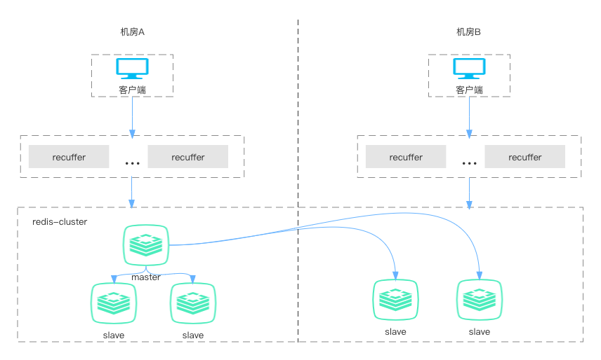

Recuffer（作业帮RedisProxy）
***
#### 项目介绍
- Recuffer是作业帮DBA团队开发的，适用于社区版RedisCluster的代理程序，通过Recuffer，应用程序可以像使用单节点Redis一样使用RedisCluster，Recuffer对应用程序屏蔽了RedisCluster底层的分片、路由、迁移、节点变更、主从切换之类的操作，可以有效降低应用的开发和运维复杂度；除此之外，我们还为Recuffer提供了多种路由策略，方便用户按需选择最适合自己的只读流量路由方式，更多Recuffer功能细节，请参考功能说明部分。
- 目前作业帮内部所有的RedisCluster集群都在使用Recuffer作为代理，在线上环境长期稳定运行。
- Recuffer是不依赖任何其他组件的无状态服务，因此也可以非常方便的进行容器化部署，作业帮内部的所有Recuffer目前都运行在K8s集群中。
***
#### 架构图
以常见的双机房部署为例，架构图如下：

***
#### 项目背景
##### 为何需要Recuffer
- 作业帮之前的KV存储一直以Codis为主，随着业务发展，Codis使用底层Server版本过低带来的各种问题越来越明显，同时Codis架构由于依赖Zookeeper、DashBoard、FE等组件，在作业帮整体的多云架构中也遇到不少问题，因此我们希望使用RedisCluster代替Codis作为主要的KV存储。
- 直接使用社区版的RedisCluster，应用需要升级驱动、调整访问方式来做兼容，改造成本过高，因此我们选择在CodisProxy的基础上，开发一个可以用于RedisCluster的Proxy程序，使应用可以平滑的从Codis升级至RedisCluster。
- 随着作业帮云原生和多云改造的进行、业务对KV存储也提出了很多新的需求，我们在实践中发现，大多数问题都可以通过Proxy这一层的功能来解决，从而减少对底层Redis的修改。这种通过RedisProxy来解决RedisCluster使用中遇到的各种问题和需求的方式，我们也觉得很有价值，这是我们将Recuffer开源的原因之一。

###### 其他项目对比
我们在自研Recuffer之前，也曾测试甚至在线上使用过其他的一些RedisCluster代理程序，但都遇到了一些问题：
- 近期缺少维护，在遇到某些异常语句或特殊命令时会出现BUG，并难以彻底解决。
- 缺少动态管控接口，路由策略简单，可运维性不强，和作业帮多云架构结合不够理想。
- 依赖过多，很难做到开箱即用和便捷的容器化部署。
- 对于很多使用RedisCluster作为KV存储的应用来说，一个便捷、稳定、高效、可运维性强的Proxy，也是较为通用的需求，这是我们将Recuffer开源的另一个原因，希望未来和更多伙伴一起，共同打造更好用的RedisProxy。

***
#### 主要功能与配置
##### 功能
- 支持RedisCluster大多数常用命令，部分命令不支持，具体命令兼容性参考[兼容性说明](#兼容性)
- RedisCluster迁移数据过程中，处理moved、ask请求，屏蔽应用感知
- 自动感知RedisCluster主从切换、增减节点等操作
- 支持读写分离
- 支持优先读功能(通过配置，优先将读请求分发到指定节点)
- 支持动态节点流量控制(指定屏蔽节点的读流量)
- 支持动态黑名单功能(client、cmd)
##### 配置
添加新配置文件，文件名可自行制定，我们使用recuffer.toml
```
cluster_addr = ""
# 这里是rediscluster的地址，如cluster_addr = "1.1.1.1:6379,2.2.2.2:6379"，可以写一个或者多个，建议多个，防止部分节点因故障连不上的情况
read_blacklist = ""
# 读节点黑名单的配置，如read_blacklist = "3.3.3.3:6379,4.4.4.4:6379"，这里配置上的节点不在接收读请求，也可以通过接口动态调整
movedconn_pool_size = 10
# 处理moved、ask请求的连接池的大小，调大会增大proxy的内存
proxy_datacenter = ""
# 这里修改为用网段，可配置多个，如proxy_datacenter = "192.168,1.1.1"
```
***
#### 编译及部署
```
# 1.执行编译命令
sh build.sh
# 2.添加配置文件，修改对应参数
# 3.启动
进入目录
recuffer --config=../conf/recuffer.toml --proxy_type=rediscluster --log-level=WARNING --ncpu=4 --max-ncpu=4
```
***
#### API使用
```
通过访问proxy的管理端口api，以下以192.168.1.1:18001示例
# 获取已屏蔽流量的节点
curl http://192.168.1.1:18001/proxy/readblacklist/get
# 屏蔽指定节点的流量
curl -X PUT http://192.168.1.1:18001/proxy/readblacklist/set/1.1.1.1:6379
# 打开指定节点的流量
curl -X PUT http://192.168.1.1:18001/proxy/readblacklist/del/1.1.1.1:6379

# 获取已屏蔽的客户端ip列表
curl http://192.168.1.1:18001/proxy/clientipblacklist/get
# 屏蔽指定客户端ip
curl -X PUT http://192.168.1.1:18001/proxy/clientipblacklist/set/3.3.3.3,5.5.5.5
# 取消屏蔽指定客户端ip
curl -X PUT http://192.168.1.1:18001/proxy/clientipblacklist/del/3.3.3.3,5.5.5.5

# 获取已屏蔽的redis命令列表
curl http://192.168.1.1:18001/proxy/cmdblacklist/get
# 屏蔽指定redis指令(包含key)，以下例子屏蔽get a
curl -X PUT http://192.168.1.1:18001/proxy/cmdblacklist/set/get/a
# 取消屏蔽指定redis指令(包含key)，以下例子取消屏蔽get a
curl -X PUT http://192.168.1.1:18001/proxy/cmdblacklist/del/get/a
```
***
#### 高可用及容器化
- 高可用:可采用单台或者多台部署，使用负载均衡转发即可
- 容器化:我们在公司使用的是在k8s中使用，本身支持容器化部署
***
<!-- #### Authors
- [@guyage](https://github.com/guyage)
- [@yangyicong](https://github.com/congshenV)
*** -->
#### 参考开源软件
- [codis](https://github.com/CodisLabs/codis)
- [go-redis](https://github.com/go-redis/redis)
***
##### 兼容性
不支持的命令
<table><colgroup><col><col><col><col></colgroup><thead><tr><th><div>CommandType</div></th><th><div>CommandName</div></th><th>CommandType</div></th><th><div>CommandName</div></th></tr></thead><tbody><tr><td>Keys</td><td>keys</td><td>Transactions</td><td>discard</td></tr><tr><td></td><td>migrate</td><td></td><td>exec</td></tr><tr><td></td><td>move</td><td></td><td>multi</td></tr><tr><td></td><td>object</td><td></td><td>unwatch</td></tr><tr><td></td><td>randomkey</td><td></td><td>watch</td></tr><tr><td></td><td>rename</td><td>Scripting</td><td>script</td></tr><tr><td></td><td>renamenx</td><td>Server</td><td>bgrewriteaof</td></tr><tr><td></td><td>scan</td><td></td><td>bgsave</td></tr><tr><td>Strings</td><td>bitop</td><td></td><td>client</td></tr><tr><td></td><td>msetnx</td><td></td><td>config</td></tr><tr><td>Lists</td><td>blpop</td><td></td><td>dbsize</td></tr><tr><td></td><td>brpop</td><td></td><td>debug</td></tr><tr><td></td><td>brpoplpush</td><td></td><td>flushall</td></tr><tr><td>Pub/Sub</td><td>psubscribe</td><td></td><td>flushdb</td></tr><tr><td></td><td>publish</td><td></td><td>lastsave</td></tr><tr><td></td><td>punsubscribe</td><td></td><td>latency</td></tr><tr><td></td><td>subscribe</td><td></td><td>monitor</td></tr><tr><td></td><td>unsubscribe</td><td></td><td>psync</td></tr></tbody></table>

***
##### License
recuffer is licensed under MIT， see LICENSE.txt
